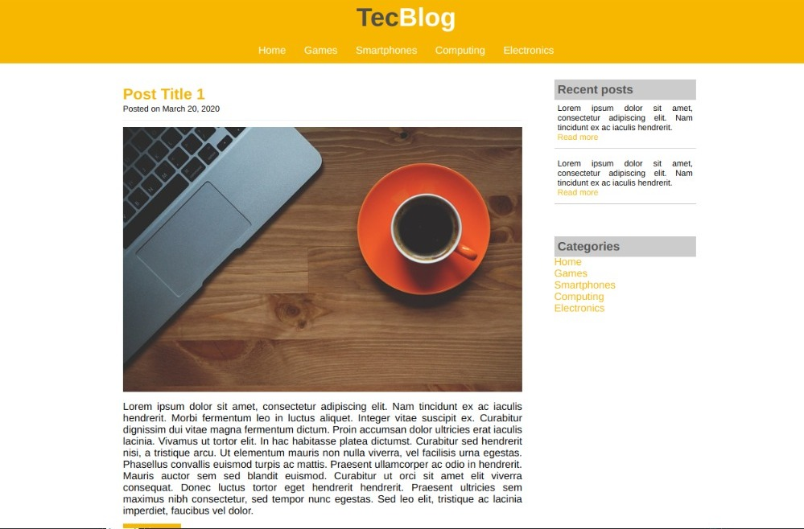

Certainly, here's the README.md translated into English:

# TechBlog (Learning Project)

Welcome to TechBlog, a fictitious blog created as a means to practice my learning in HTML and CSS. This repository contains the source code of the blog and is intended for developers who want to learn or collaborate on the development of a simple blog project using basic web technologies.

## Overview

TechBlog is a project blog that is not intended to provide real content but rather serve as an example of a simple blog website created with HTML and CSS. This project was created with the purpose of demonstrating web design and development skills using the following technologies:

- **HTML5**: For page structure and content.
- **CSS3**: For styling and layout.
- **Basic Features**: This project includes a fictitious blog homepage.

## Contribution

While this project is fictitious, I am open to contributions and improvements from other developers who want to practice their HTML and CSS skills. Please feel free to fork this repository and submit a pull request with your enhancements. Be sure to follow our contribution guidelines, which can be found in the [CONTRIBUTING.md](CONTRIBUTING.md) file.

## Local Installation

If you want to run a local version of this project for learning purposes, follow these steps:

1. Clone this repository: `git clone https://github.com/your-username/techblog.git`
2. Navigate to the cloned directory: `cd techblog`
3. Open the `index.html` file in your browser to view the fictitious blog.

## Acesso ao Blog

You can access the fictional blog [here](https://douglasars.github.io/TecBlog-Project/) and explore the learning content in HTML and CSS.

## Contact

If you have any questions, suggestions, or feedback related to the TechBlog learning project, please feel free to get in touch:

- Email: your-email@example.com
- GitHub: [your-username](https://github.com/your-username)

Thank you for exploring this HTML and CSS learning project!